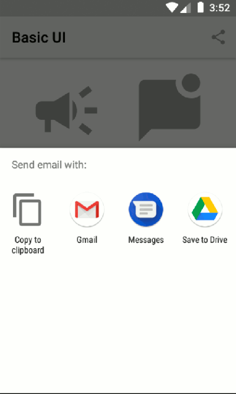

[![LinkedIn][linkedin-shield]][linkedin-url]
[](http://kotlinlang.org)
[](https://github.com/machadaCosta/)

# Basic UI


A Basic UI in _Android_ with _kotlin_.



This is a showcase of simple UI elements like **toast** and **alert**, using Splitties.
Also this project implement **sending email**, **sharing content**, **opening a web page**
using _Android SDK_ and extension function with _Kotlin_.
It was created from `Basic Activity` template from _Android Studio_.

<!-- TABLE OF CONTENTS -->
<details open="close">
  <summary>Table of Contents</summary>
  <ul>
    <li>
      <a href="#getting-started">Getting Started</a>
      <ul>
        <li><a href="#prerequisites">Prerequisites</a></li>
        <li><a href="#installation">Installation</a></li>
      </ul>
    </li>
    <li><a href="#usage">Usage</a></li>
    <li><a href="#roadmap">Roadmap</a></li>
    <li><a href="#contributing">Contributing</a></li>
    <li><a href="#license">License</a></li>
    <li><a href="#contact">Contact</a></li>
    <li><a href="#acknowledgements">Acknowledgements</a></li>
  </ul>
</details>

## Getting Started

This is an _Android_ project made with _Kotlin_ language.

### Prerequisites

Install [Android Studio](https://developer.android.com/studio), see instructions
on [ChillCoding.com](https://www.chillcoding.com/blog/2016/08/03/android-studio-installation/),
in FR.

### Installation

1. Clone the repo
   ```sh
   git clone https://github.com/machadaCosta/basic-ui.git
   ```
2. Open an Existing Project in _Android Studio_

## Dependencies

### Libraries
  * [Splitties: All the Android splits](https://github.com/LouisCAD/Splitties)

### Other
  * [View Binding, Part of Android Jetpack](https://developer.android.com/topic/libraries/view-binding)

## Usage

Use this space to show beautiful User Interface elements.

## Roadmap

See the [open issues](https://github.com/machadaCosta/basic-ui/issues) for a list of proposed features (and known issues).

## Contributing

Contributions are what make the open source community such an amazing place to be learn, inspire, and create. Any contributions you make are **greatly appreciated**.

1. Fork the Project
2. Create your Feature Branch (`git checkout -b feature/AmazingFeature`)
3. Commit your Changes (`git commit -m 'Add some AmazingFeature'`)
4. Push to the Branch (`git push origin feature/AmazingFeature`)
5. Open a Pull Request

## License

Distributed under the GNU General Public License v3.0. See [LICENSE](https://github.com/machadaCosta/basic-ui/blob/main/LICENSE) for more information (cf. [Choose an open source license](https://choosealicense.com/)).

## Contact

Macha DA COSTA, on [ChillCoding](https://www.chillcoding.com/?#about).

[linkedin-url]: https://www.linkedin.com/in/MachaDaCosta/
